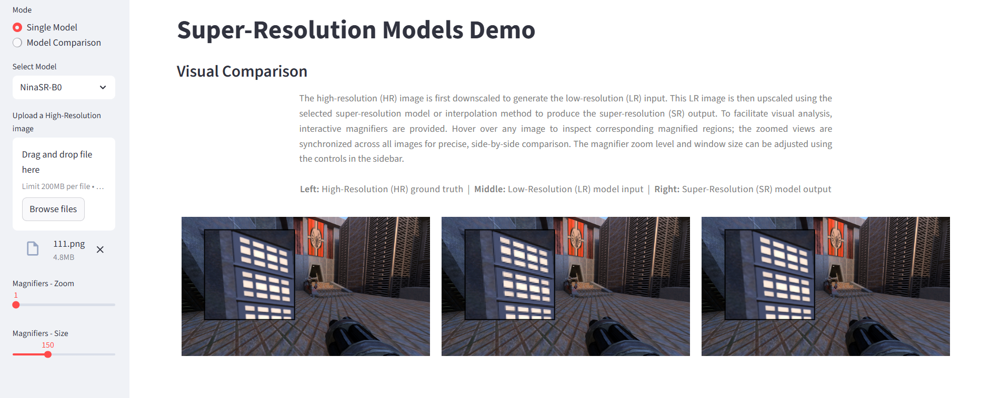
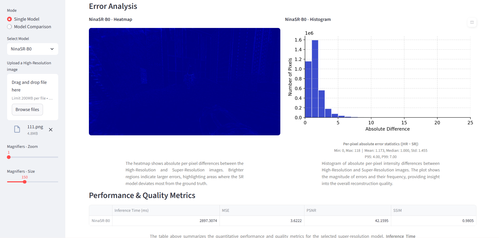
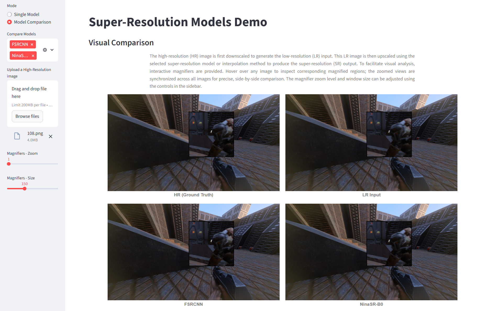
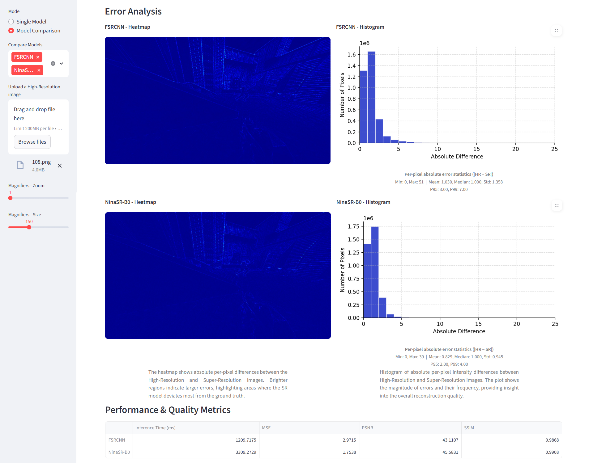

# Interactive Super-Resolution Visualization Tool
This repository contains an interactive visualization application 
for analyzing and comparing image super-resolution methods.
The tool is designed to support both qualitative inspection and error analysis 
of super-resolved images, and is primarily intended for research 
and experimental evaluation of super-resolution methods.

The application allows users to load pre-trained SR models, apply them to selected images, 
and interactively explore reconstruction results and error maps.

## Screenshots
Functionality and user interface is presented on selected screenshots.

**Single-model mode**
---




**Model comparison mode**
---




## Repository Structure
```
.
├── app.py          # Main application entry point and UI logic
├── utils.py        # Helper functions (loading data, metrics, visualization utilities)
├── models/         # Model architecture definitions
│   └── ...         # Individual model implementations
├── weights/        # Pre-trained model checkpoints
│   └── ...         # Model weight files
├── requirements.txt
└── README.md
```

## Running the Application
To start the interactive application, run:
```
streamlit run app.py
```
